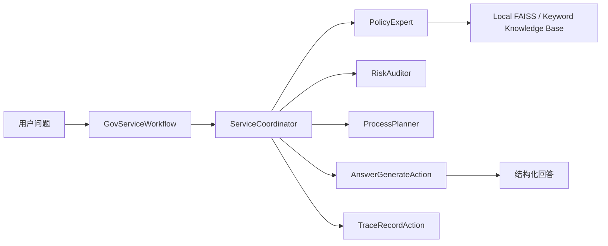
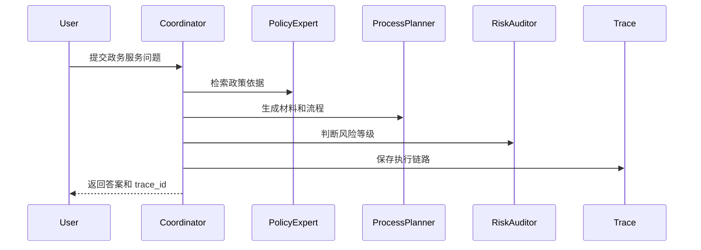
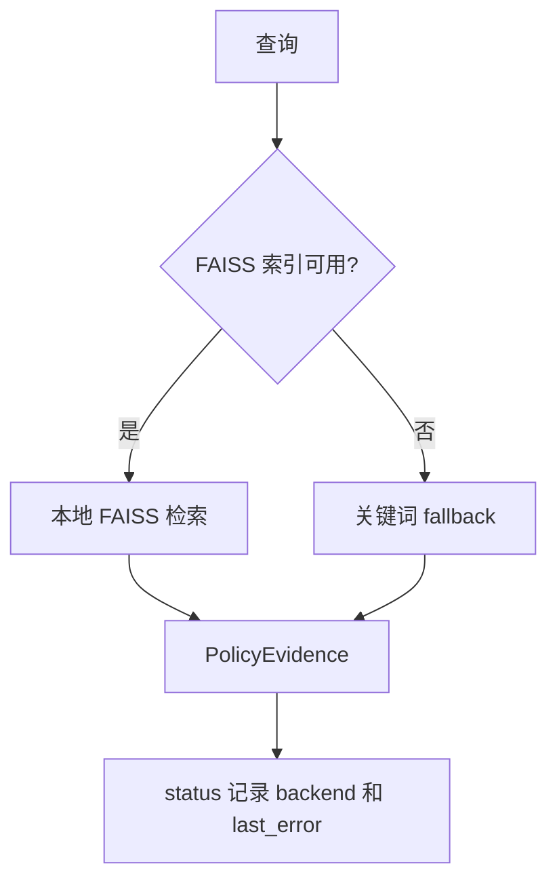
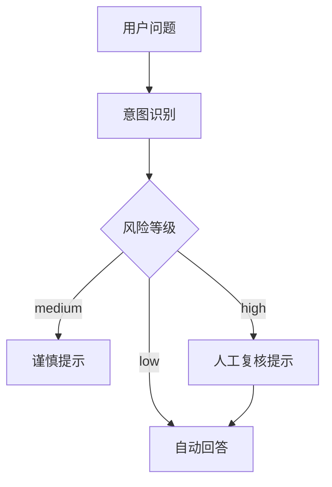
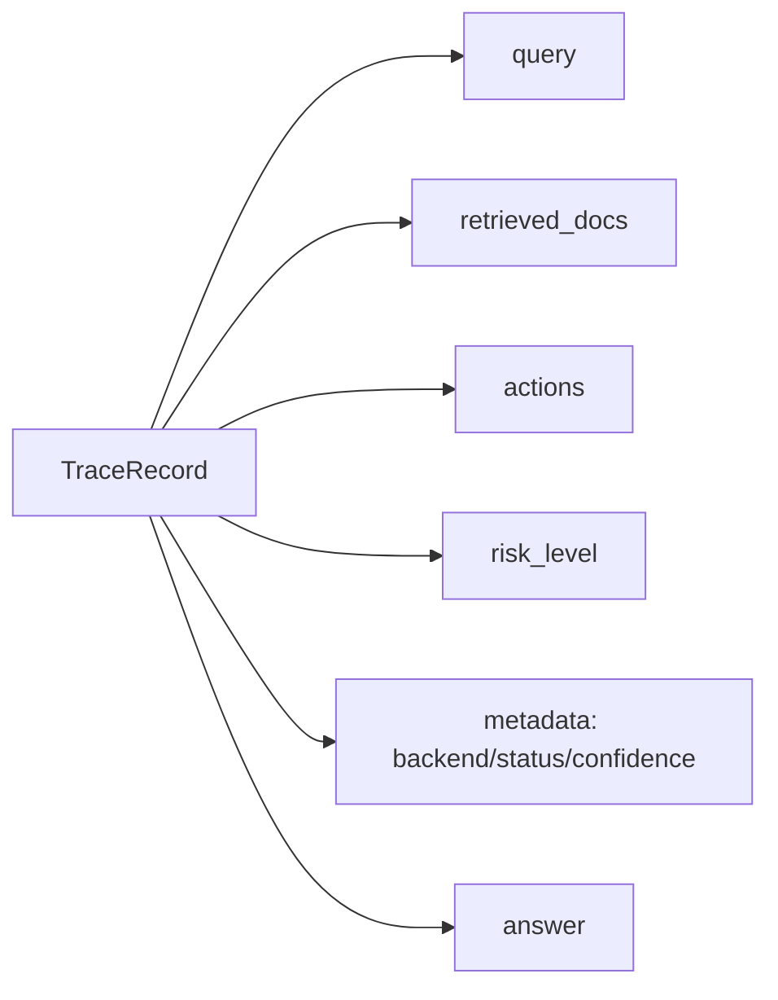

# 图表清单

## 图1 系统总体架构图

```mermaid
flowchart LR
  U["用户问题"] --> W["GovServiceWorkflow"]
  W --> C["ServiceCoordinator"]
  C --> P["PolicyExpert"]
  C --> R["RiskAuditor"]
  C --> G["ProcessPlanner"]
  C --> A["AnswerGenerateAction"]
  P --> KB["Local FAISS / Keyword Knowledge Base"]
  A --> O["结构化回答"]
  C --> T["TraceRecordAction"]
```

## 图2 多智能体协同流程图

```mermaid
sequenceDiagram
  participant User
  participant Coordinator
  participant PolicyExpert
  participant ProcessPlanner
  participant RiskAuditor
  participant Trace
  User->>Coordinator: 提交政务服务问题
  Coordinator->>PolicyExpert: 检索政策依据
  Coordinator->>ProcessPlanner: 生成材料和流程
  Coordinator->>RiskAuditor: 判断风险等级
  Coordinator->>Trace: 保存执行链路
  Coordinator-->>User: 返回答案和 trace_id
```

## 图3 本地 FAISS 检索与降级流程图

```mermaid
flowchart TD
  Q["查询"] --> S{"FAISS 索引可用?"}
  S -- 是 --> F["本地 FAISS 检索"]
  S -- 否 --> K["关键词 fallback"]
  F --> E["PolicyEvidence"]
  K --> E
  E --> ST["status 记录 backend 和 last_error"]
```

## 图4 风险分级与人工复核流程图

```mermaid
flowchart TD
  Q["用户问题"] --> I["意图识别"]
  I --> R{"风险等级"}
  R -- low --> A["自动回答"]
  R -- medium --> B["谨慎提示"]
  R -- high --> H["人工复核提示"]
  H --> A
```

## 图5 可追溯日志结构图

```mermaid
flowchart LR
  T["TraceRecord"] --> Q["query"]
  T --> D["retrieved_docs"]
  T --> A["actions"]
  T --> R["risk_level"]
  T --> M["metadata: backend/status/confidence"]
  T --> O["answer"]
```
